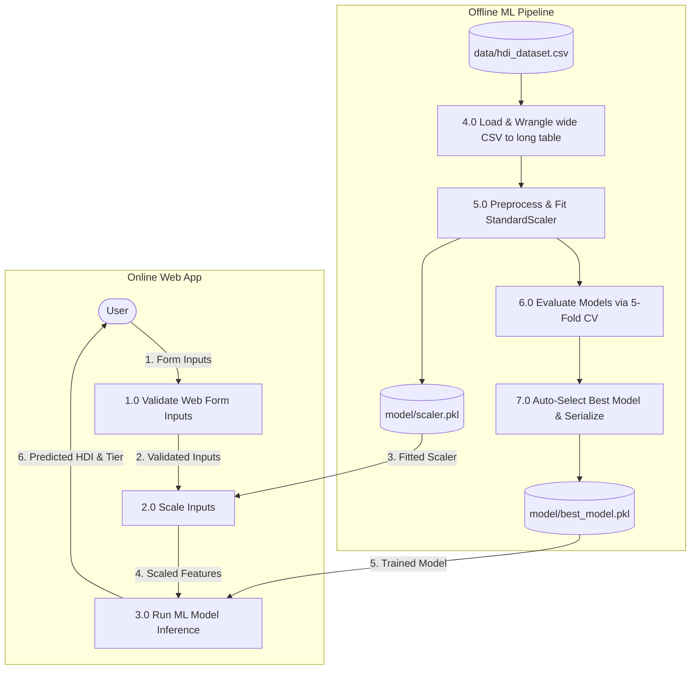

# Data Flow Diagram

**Date:** 27 June 2026  
**Team ID:** [Enter Team ID]  
**Project Name:** HDI Predictor  

## DFD Legend
* **External Entity (Oval):** User (Policy Researcher / General Public)
* **Process (Rectangle with numbered header):** Operations that transform data
* **Data Store (Rectangle, solid fill):** Files containing data (`hdi_dataset.csv`, model serialization files)
* **Data Flow (Labeled Arrow):** Movement of data between entities and processes

## Mermaid Flowchart

